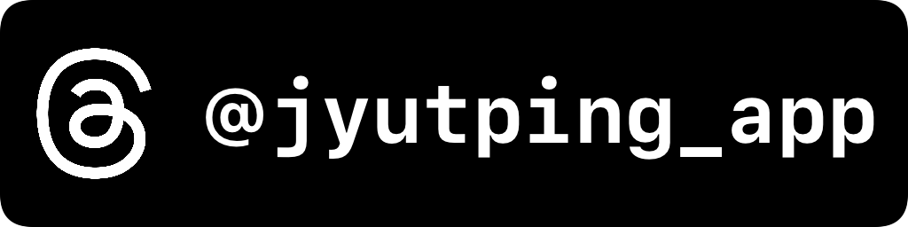
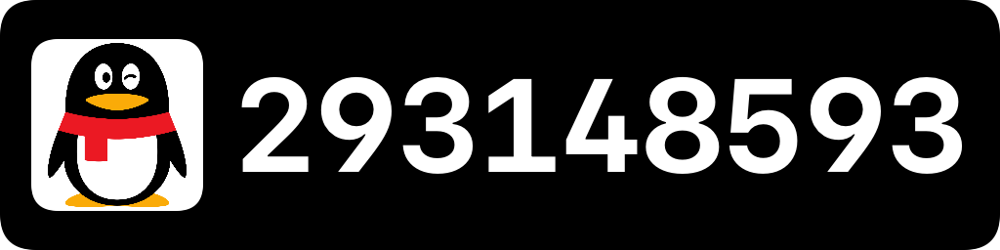
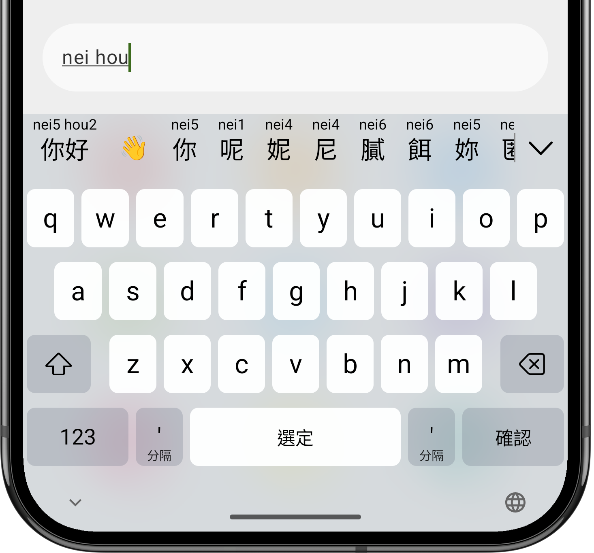

README en [Español](README.md) | [English](README-en.md) | [粵語 (cantonés)](README-yue.md) | [普通話 (mandarín)](README-cmn.md)

Jyutping — Teclado de cantonés
======

 
 

Método de entrada (teclado) de cantonés para Android.

Utiliza el [sistema de romanización Jyutping de la Sociedad Lingüística de Hong Kong (LSHK)](https://jyutping.org/jyutping) y admite las grafías habituales más comunes.
Los candidatos muestran su Jyutping correspondiente.
Admite caracteres chinos tradicionales y simplificados, así como distintos estándares de forma de carácter.
Permite la búsqueda inversa del Jyutping mediante Cangjie, Quick (Sucheng), trazos, pinyin mandarín o descomposición de caracteres.

## Características principales

- Compatibilidad completa con la escritura en Jyutping.
- Escritura abreviada usando solo las iniciales del Jyutping.
- Escritura precisa con indicación de tonos.
- Caracteres tradicionales y simplificados.
- Búsqueda inversa con Cangjie, Quick (Sucheng), trazos o pinyin mandarín.
- Indicaciones de Jyutping sobre los candidatos.
- Sugerencias de emojis.
- Formas rápidas de copiar, cortar, pegar y mover el cursor.
- Respuesta sonora y háptica (vibración).

## Esta edición en español

Este repositorio es una copia traducida al español del proyecto original
[yuetyam/jyutping-android](https://github.com/yuetyam/jyutping-android).

Qué se ha traducido:

- La interfaz de la aplicación y del teclado (`app/src/main/res/values/` y `values-b+es/`).
- La documentación del repositorio (este README).
- La ficha de la tienda para F-Droid (`metadata/es-ES/`).
- Los comentarios del código fuente que estaban en chino.

El español es ahora el idioma predeterminado de la aplicación. Los idiomas
originales se conservan íntegros y siguen estando disponibles: inglés
(`values-b+en`), cantonés (`values-b+yue`) y chino (`values-b+zh`). En Android 13
y versiones posteriores puedes cambiar el idioma de la aplicación desde los
ajustes del sistema.

Lo que **no** se traduce, por motivos funcionales:

- Los diccionarios y datos lingüísticos (`preparing/src/main/resources/`).
- Las tablas de conversión entre caracteres tradicionales y simplificados.
- Los caracteres de ejemplo, los nombres de los tonos y las filas de AFI de las
  tablas de iniciales, finales y tonos.
- Los ejemplos de uso del cantonés (sus títulos y explicaciones sí están en
  español; las frases de ejemplo son justamente lo que se enseña).
- El texto de las teclas del teclado: cambia según el conjunto de caracteres que
  estés escribiendo (tradicional o simplificado), no según el idioma de la
  interfaz. Traducirlo rompería el comportamiento del teclado.
- Los nombres propios de los recursos externos sobre cantonés y las citas de los
  diccionarios clásicos.

Ese contenido es el objeto de estudio de la aplicación, no texto de interfaz.

## Otras versiones para otros sistemas

- [iOS y macOS](https://github.com/yuetyam/jyutping)
- [Windows](https://github.com/yuetyam/jyutping-windows)
- [HarmonyOS](https://github.com/yuetyam/jyutping-harmony)

## Capturas de pantalla

## Descarga e instalación

 

 
 

 

 
 
Encontrarás más formas de descarga en el sitio web oficial: https://jyutping.app/android

## Cómo compilar el proyecto

Requisitos previos:
- Android Studio 2026.1.3 o superior
- JDK 21

El repositorio es bastante grande; se recomienda clonarlo con `--depth`:
~~~bash
git clone --depth 1 https://github.com/lyanvalentinmail-prog/One-Keyboard-.git
~~~

Primero hay que generar las bases de datos:
~~~bash
# cd ruta/a/One-Keyboard-
cd ./preparing/
./gradlew run
~~~

Después ya puedes abrir el proyecto con Android Studio, o compilarlo desde la terminal:
~~~bash
./gradlew :app:assembleDebug
~~~

## Agradecimientos
- [yuetyam/jyutping-android](https://github.com/yuetyam/jyutping-android) (proyecto original)
- [Rime-Cantonese](https://github.com/rime/rime-cantonese) (léxico cantonés)
- [OpenCC](https://github.com/BYVoid/OpenCC) (conversión entre caracteres tradicionales y simplificados)
- [JetBrains](https://www.jetbrains.com/) (licencias para desarrollo de código abierto)

## Licencia

El proyecto original se publica bajo **CC0 1.0 Universal** (dedicación al dominio
público). Consulta el archivo [COPYING.txt](COPYING.txt). Esta traducción se
publica en los mismos términos.

## Apoya al autor original
Sitio web: https://jyutping.app/donate

愛發電: https://afdian.com/a/jyutping

Ko-fi: https://ko-fi.com/zheung

Patreon: https://patreon.com/bingzheung

PayPal: https://paypal.me/bingzheung

Bitcoin: `bc1qx5tjmlvq8ydmfzxt5fru7vqq0khjkhf2savheh`

